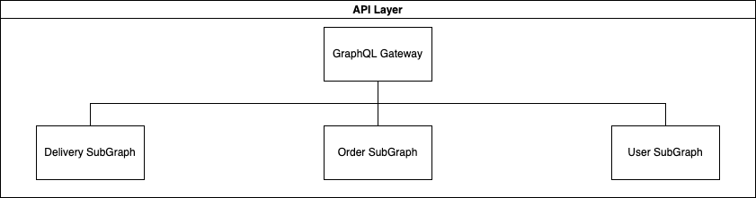
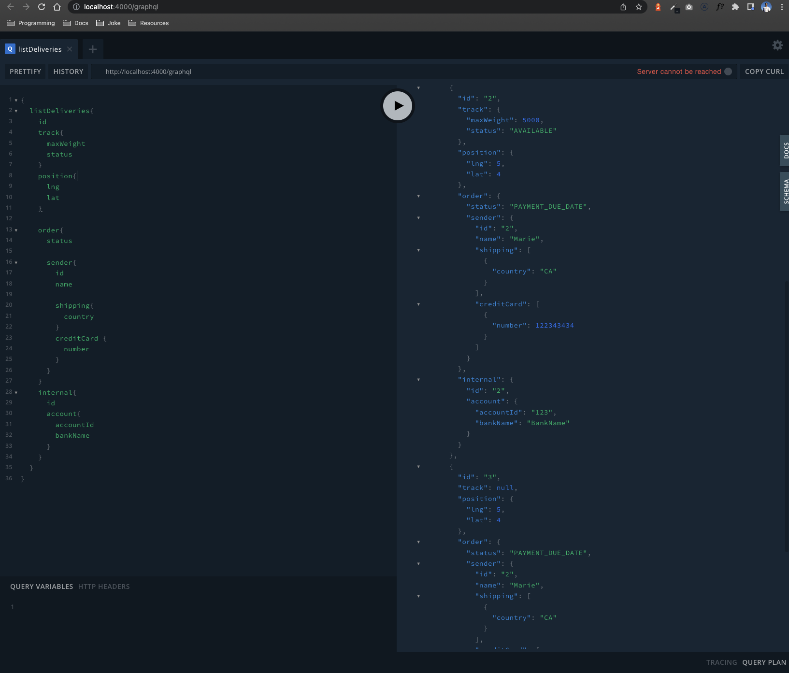

# Package Workshop



Orders subgraph is build on nodejs because is single threaded this allow to handle all requests on a queue to prevents concurrent orders because we have a limit of weight to each vehicle.

## Configurations

Before start you should have some configurations setups.

- Execute with python and node each app or install docker.

## Starting  🚀

These instructions will allow you to get a copy of the project running on your local machine for development and testing purposes.

See **Deployment** to know how to deploy the project.

### Pre-requirements 📋

To use the project it is necessary to install Node or docker.

Please read the documentation to add, remove or update the project, below some of the most used commands

[Workflows doc](https://docs.docker.com/)

### **List of commands**

- `docker-compose build`
- `docker-compose up`

## Open Endpoints

> All Endpoints

Open endpoints require no Authentication. When you run the docker-compose up you should go to Gateway route to see how the endpoints are merged.

- [Delivery](./docs/login.md) : `http://0.0.0.0:3002/graphql`
- [Gateway](./docs/signup.md) : `http://localhost:4000/graphql`
- [User](./docs/signup.md) : `http://localhost:3001/graphql`
- [Order](./docs/signup.md) : `http://localhost:3003/graphql`

Copy and run the follow command in the graphql playground

```graphql
{
  listDeliveries{
    id
    track{
      maxWeight
      status
    }
    position{
      lng
      lat
    }
    
    order{
      status
      
      sender{
        id
        name
        
        shipping{
          country
        }
        creditCard {
          number
        }
      }
    }
    internal{
      id
      account{
        accountId
        bankName
      }
    }
  }
}
```



### Installation  🔧

Docker supports running a local server for mocking and testing your application before pushing to the repository, After running docker on the root of the project.

## Folder structure 🦴

    .
    ├── apps                    # Folder for micro-services
    │   ├── user-subgraph       # NestJS API (NodeJS)
    │   ├── order-subgraph      # NestJS API (NodeJS)
    │   ├── delivery-subgraph   # FastAPI API (Python)
    │   └── gateway             # NestJS gateway (NodeJS central endpoint )
    ├── libs                    # Common configurations for each microservice
    │   ├── core                # Core library
    │   └── redis               # Redis configuration (Not defined yet)
    ├── package.json            # Libraries for all NodeJS projects
    └── README.md

## Running the tests ⚙️

We use [react-testing-library](https://testing-library.com/docs/react-testing-library/intro/)

```sh
yarn test
```

## Encoding style  ⌨️

NestJS

## Built with  🛠️

- [NestJS](https://docs.nestjs.com/)  - **NestJS** is a TypeScript library for building efficient, scalable Node.js server-side applications

- [yarn](https://yarnpkg.com/) is the default package management system

- [GitLab](https://about.gitlab.com/) - Version control systems

## Contributing  🖇️

To contribute to the project please follow the steps below, do not forget to describe the changes in the pull request and comment on it by slack in the corresponding channel.

1. Fork of the repository.
2. Clone the repository.
3. Update the master branch.
4. Create a branch.
5. Make changes.
6. Make a Pull Request.

## Wiki  📖

[Package wiki](https://google.com)

## Versionado  📌

We use [SemVer] (<http://semver.org/>) for versioning. For all available versions, check out the [tags in this repository]

_To start using tags in git read the following [documentation](https://www.atlassian.com/git/tutorials/inspecting-a-repository/git-tag)_

## Authors  ✒️

Mention all those who helped build the project since its inception.

- **Crhistian Caraballo**

## Expressions of Gratitude  🎁

- Tell others about this project 📢
- Invite a beer 🍺 or a coffee ☕ to someone from the team.
- Give thanks publicly 🤓.
  